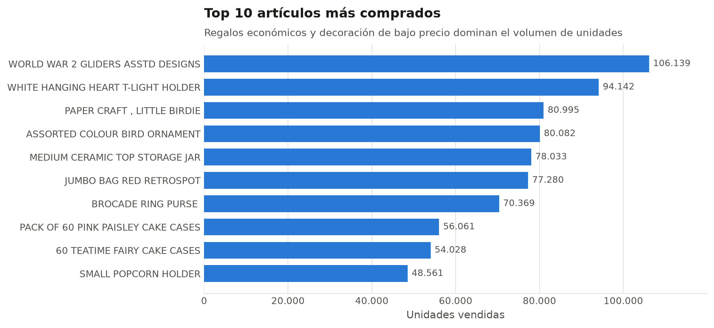
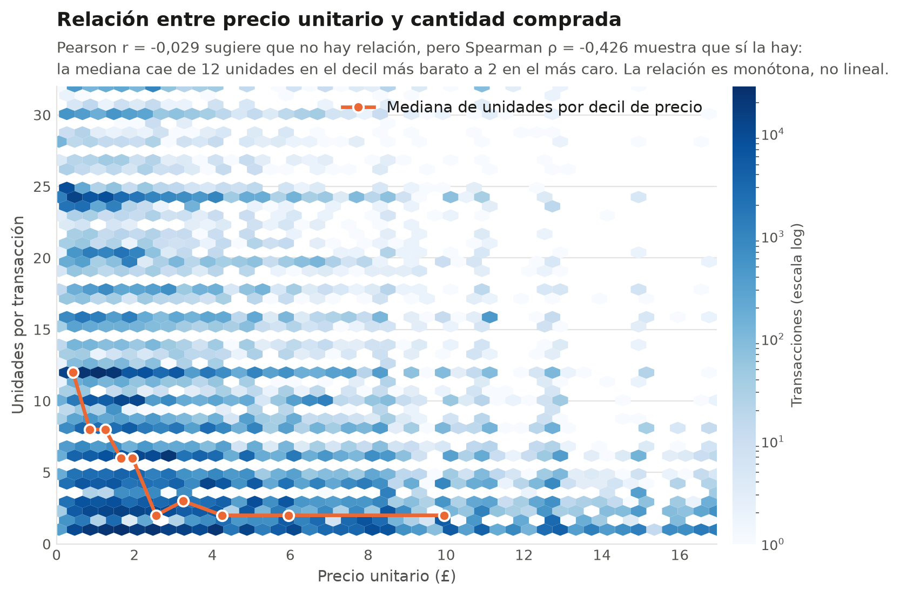
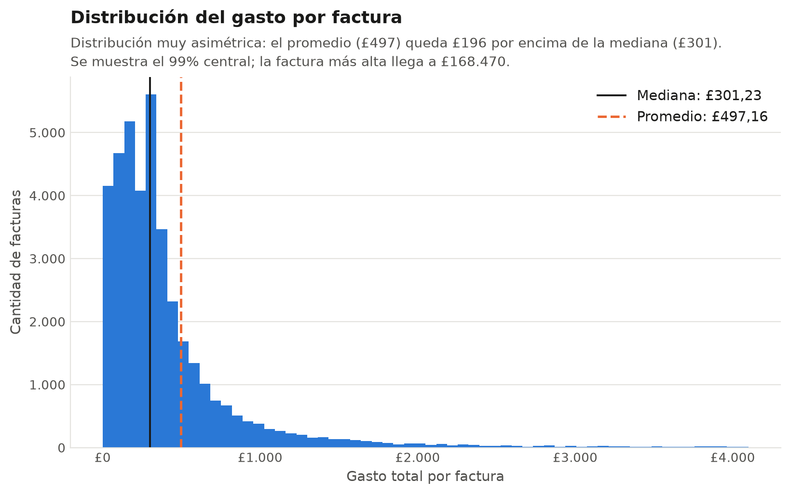
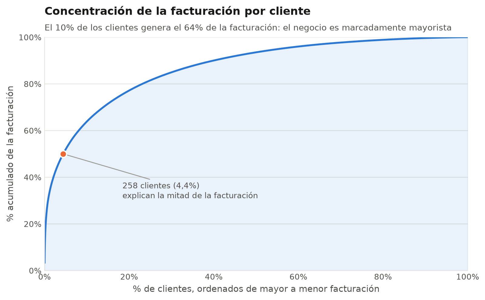
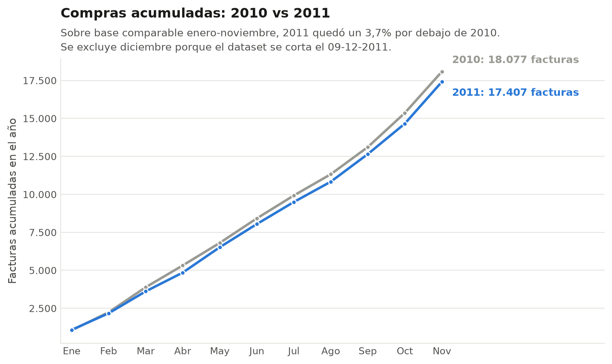
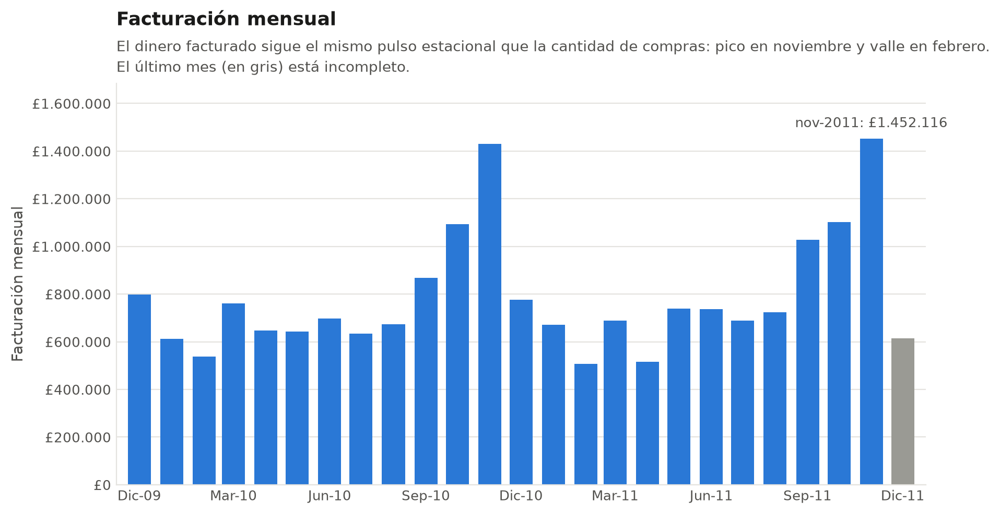
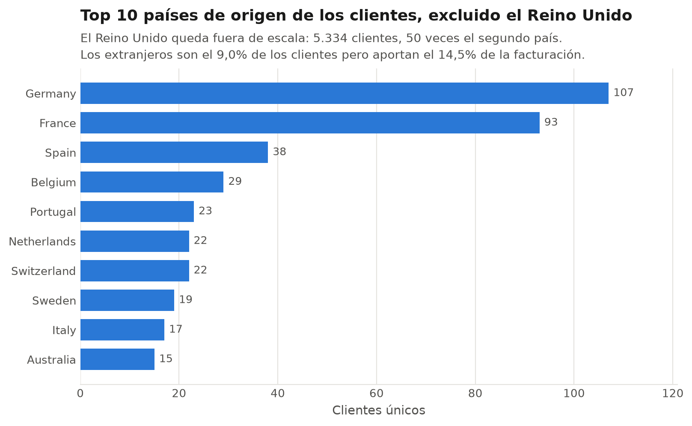

# Online Retail Analysis


## Descripción del Proyecto

Este proyecto es el trabajo final del curso "Data Scientist: Analytics" de Codecademy. Consiste en un Análisis Exploratorio de Datos (EDA) completo sobre el dataset **Online Retail II**, que contiene todas las transacciones realizadas entre el 1 de diciembre de 2009 y el 9 de diciembre de 2011 por una empresa de venta minorista en línea, con base en el Reino Unido y sin establecimiento físico, dedicada principalmente a la venta de artículos de regalo únicos para cualquier ocasión. Una gran parte de sus clientes son mayoristas.

Se eligió este dataset por su volumen (más de un millón de filas) y por contener datos faltantes, duplicados, registros administrativos y valores inconsistentes, lo que permitió aplicar un proceso realista de limpieza y curado antes del análisis.

El proyecto recorre el proceso completo de análisis de datos: carga del dataset, exploración inicial, limpieza y formateo, EDA guiado por preguntas de negocio, hallazgos claves y conclusiones.

Link Notebook: [nbviewer](https://nbviewer.org/github/AgusPluda/online-retail-analysis/blob/main/online_retail_analysis.ipynb)

---

## Objetivos

* Explorar la estructura y calidad del dataset.
* Limpiar y formatear los datos, documentando y justificando cada decisión tomada.
* Responder preguntas de negocio sobre artículos, facturas, clientes, fechas/horas y países a través de visualizaciones.
* Contrastar una hipótesis de negocio mediante una prueba estadística formal.
* Comunicar hallazgos claros y accionables a partir del análisis.

---

## Dataset

El dataset original (`online_retail_II.csv`) contiene las transacciones registradas por la empresa, con la siguiente estructura:

| Variable      | Descripción                                                          |
| ------------- | --------------------------------------------------------------------- |
| `Invoice`     | Número de factura (los que comienzan con "C" corresponden a cancelaciones) |
| `StockCode`   | Código de producto                                                    |
| `Description` | Descripción del producto                                              |
| `Quantity`    | Cantidad de unidades por línea de transacción                         |
| `InvoiceDate` | Fecha y hora en la que se generó la transacción                       |
| `Price`       | Precio unitario del producto (en libras esterlinas, £)                |
| `Customer ID` | Identificador único del cliente                                       |
| `Country`     | País del cliente                                                      |

Durante la limpieza se renombraron las columnas a snake_case y se agregaron variables derivadas (`invoice_date`, `invoice_time`, `canceled`, `total_price`), además de generarse tres subconjuntos: el dataset limpio completo, uno filtrado a productos comerciales y otro filtrado a ventas efectivas. Por el límite de tamaño de archivo de GitHub, estos CSV curados se alojan externamente ([enlace en el notebook](https://drive.google.com/drive/folders/1EDneaog4fd4tv6MaOQ1AsZ5pwIqul1bW?usp=sharing)) en lugar de subirse al repositorio.

Fuente: [Online Retail II — Kaggle](https://www.kaggle.com/datasets/mashlyn/online-retail-ii-uci)

---

## Tecnologías Utilizadas

* Python
* Pandas
* NumPy
* Matplotlib
* Seaborn
* SciPy (prueba de Mann–Whitney U)
* Jupyter Notebook

---

## Curado de Datos

Antes del EDA se realizó un proceso de limpieza y formateo justificado paso a paso:

* **Datos nulos:** de 247.389 celdas vacías, se eliminaron las filas sin descripción de producto (4.382); los IDs de cliente faltantes (243.007) se conservaron ya que el análisis no se centra en clientes individuales.
* **Duplicados:** se eliminaron 34.228 filas duplicadas.
* **Registros no comerciales:** mediante una expresión regular sobre `StockCode`, se identificaron y separaron los códigos administrativos (ajustes, cargos bancarios, gastos de envío, registros de prueba, etc.) en un DataFrame `df_products`, distinto del análisis de artículos.
* **Cantidades y precios inconsistentes:** se analizaron los valores de `Quantity` y `Price` menores o iguales a cero (cancelaciones, devoluciones y ajustes de inventario) y se generó `df_sales`, un DataFrame con únicamente transacciones de venta efectiva (cantidad y precio positivos).
* **Formateo:** columnas renombradas a snake_case, `customer_id` convertido a string, `invoice_datetime` convertido a datetime, y creación de las columnas derivadas `invoice_date`, `invoice_time`, `canceled` y `total_price`.

---

## Análisis Exploratorio de Datos (EDA)

El análisis se organizó en preguntas de negocio agrupadas por tema:

**Artículos**
* ¿Cuáles son los 10 artículos más comprados?
* ¿Cuáles son los artículos más caros y más baratos por unidad?
* ¿Es más probable comprar más cantidad cuando el producto es más barato?

**Facturas y Clientes**
* ¿Cuánto gasta el cliente en promedio por factura?
* ¿Cuáles son las facturas más caras?
* ¿Qué clientes gastaron más?
* ¿Qué tan concentrada está la facturación en unos pocos clientes?

**Fechas y Horas**
* ¿Existe un aumento en la cantidad de compras entre 2010 y 2011?
* ¿En qué meses del año se compra más?
* ¿Cómo evolucionó la facturación mes a mes?
* ¿A qué hora del día se dan más compras?

**Países**
* ¿De dónde provienen los clientes y cuánto pesan los mercados extranjeros?

**Extras**
* Matriz de correlación entre cantidad, precio unitario, precio total y estado de cancelación.
* Hipótesis: ¿las facturas de mayor valor tienen mayor probabilidad de ser canceladas? Contrastada con un boxplot en escala logarítmica, un barplot de medianas con intervalo bootstrap y una prueba de Mann–Whitney U.

Cada gráfico responde una pregunta distinta: los que resultaron redundantes o poco informativos (un boxplot que repetía el histograma de gasto, un ranking de facturas por ID, una torta de dos porciones y un barplot de medias sobre una distribución de cola pesada) se eliminaron en lugar de conservarse por inercia. Todas las visualizaciones comparten un mismo sistema visual definido una sola vez en el notebook: azul para la serie principal, naranja como acento para destacar un elemento puntual y rojo reservado al estado "cancelada".

---

## Hallazgos Claves

1. **Los regalos económicos dominan las ventas.** Los 3 artículos más vendidos (aviones de cartón de la Segunda Guerra Mundial, porta velas colgantes con forma de corazón y un pack de manualidades de papel) son productos baratos, lo que confirma el perfil de "regalería" del negocio.
2. **El catálogo cubre un rango de precio enorme**, desde £0,03 en papelería hasta £1.157 en una bandera de coche de Inglaterra; los artículos caros son muebles y objetos voluminosos, de baja rotación.
3. **Sí se compra más cantidad cuando el artículo es más barato, pero la relación no es lineal.** La correlación de Pearson es casi nula (r = -0,029) y llevaría a descartar la relación; la de Spearman, que mide relaciones monótonas, da ρ = -0,426. Por deciles de precio, la mediana de unidades cae de 12 a 2.
4. **El gasto promedio por factura es de £497,16, pero la mediana es de solo £301,23**, lo que confirma la presencia de clientes mayoristas que elevan fuertemente el promedio.
5. **Existe una factura extrema que distorsiona varios análisis:** la N° 581.483, por más de £160.000, correspondiente a casi 81.000 unidades de un solo artículo, lo que explica por qué ese producto aparece en el top 3 de más vendidos.
6. **La facturación está muy concentrada:** 258 clientes (el 4,4% de los identificados) explican la mitad de los ingresos, y el 10% superior llega al 64%. El negocio se sostiene sobre un núcleo reducido de revendedores.
7. **La cantidad de compras cayó un 3,71% de 2010 a 2011**, medido sobre una base comparable de enero a noviembre. La comparación de años completos sugería un 7,15%, pero ese número estaba distorsionado por un diciembre de 2011 truncado al día 9.
8. **La facturación, en cambio, se sostuvo:** ambos años cierran en niveles similares, lo que indica que la caída en cantidad de facturas se compensó con un ticket promedio estable.
9. **Noviembre es, por lejos, el mes con más compras**, previo a Navidad y Año Nuevo; marzo aparece como un segundo pico asociado a la Pascua de esos años.
10. **Las facturas se concentran entre las 6 y las 20 horas, con pico al mediodía**, reflejo de que eran cargadas manualmente por empleados durante su horario laboral.
11. **El negocio depende fuertemente del Reino Unido:** los clientes extranjeros son apenas el 9,0% del total, aunque aportan el 14,5% de la facturación, es decir que gastan más por cliente.
12. **Las facturas canceladas son mucho más chicas, no más grandes.** Su mediana es de £17,00 frente a £302,24 de las no canceladas, y la prueba de Mann–Whitney U confirma que la diferencia es estadísticamente significativa (p < 0,05): las cancelaciones responden a devoluciones puntuales, no a arrepentimientos sobre compras grandes.

---

## Visualizaciones de Muestra

### Top 10 artículos más comprados

<p align="center">
  
</p>

---

### Relación entre precio unitario y cantidad comprada

Pearson daba por inexistente una relación que sí está: agrupando por deciles de precio, la mediana de unidades cae de 12 a 2.

<p align="center">
  
</p>

---

### Distribución del gasto por factura

<p align="center">
  
</p>

---

### Concentración de la facturación por cliente

<p align="center">
  
</p>

---

### Compras acumuladas: 2010 vs 2011

<p align="center">
  
</p>

---

### Facturación mensual

<p align="center">
  
</p>

---

### Top 10 países de origen de los clientes

<p align="center">
  
</p>

---

## Conclusiones

Este proyecto permitió recorrer el proceso completo de un análisis de datos real, desde la carga de un dataset con más de un millón de filas hasta la comunicación de hallazgos concretos. Trabajar con datos faltantes, duplicados, códigos no comerciales y valores inconsistentes en cantidad y precio implicó tomar decisiones de limpieza justificadas en cada paso, en lugar de aplicar reglas automáticas, resultando en un análisis que refleja la realidad de una tienda de regalería online con una fuerte componente mayorista.

Dos hallazgos dejaron una lección metodológica más valiosa que los números en sí. El primero es la relación entre precio y cantidad: mirando solo la correlación de Pearson se habría concluido que no existe, cuando en realidad existe y es clara, pero monótona en vez de lineal. El segundo es la caída interanual: comparar 2010 contra 2011 sin notar que el dataset se corta el 9 de diciembre duplicaba el tamaño real de la caída. En ambos casos el resultado inicial no era falso por un error de código, sino por no haber cuestionado qué estaba midiendo la métrica elegida.

El dataset también presenta limitaciones: no indica el motivo de cancelaciones o devoluciones, no incluye datos demográficos ni de segmentación de clientes más allá del país, abarca poco más de dos años (insuficiente para tendencias de largo plazo o estacionalidad robusta) y no contiene información de costos, por lo que no es posible calcular margen o rentabilidad, solo facturación.

Como próximos pasos, se plantea profundizar el análisis de clientes mediante una segmentación RFM (recencia, frecuencia, monto), explorar un análisis de canasta de mercado (market basket analysis), construir un modelo simple de series de tiempo para proyectar la demanda mensual, e incorporar herramientas de visualización interactiva (Power BI o Tableau) para navegar el análisis dinámicamente.

---

## Estructura del Proyecto

```text
online-retail-analysis/
│
├── data/
│   └── online_retail_II.csv
│
├── images/
│   ├── 01_top10_articulos_comprados.png
│   ├── 02_articulos_caros_baratos.png
│   ├── 03_precio_vs_cantidad.png
│   ├── 04_dist_gasto_factura.png
│   ├── 05_top10_clientes.png
│   ├── 06_pareto_clientes.png
│   ├── 07_compras_acumuladas_2010_2011.png
│   ├── 08_compras_por_mes.png
│   ├── 09_facturacion_mensual.png
│   ├── 10_compras_por_hora.png
│   ├── 11_top10_paises.png
│   ├── 12_matriz_correlacion.png
│   ├── 13_factura_por_estado.png
│   └── 14_mediana_factura_bootstrap.png
│
├── online_retail_analysis.ipynb
├── README.md
├── requirements.txt
└── .gitignore
```

---

## Autor

**Agustín Pluda**

Este proyecto fue desarrollado como parte de mi portafolio de Data Science, como trabajo final del curso Data Scientist: Analytics de Codecademy.
