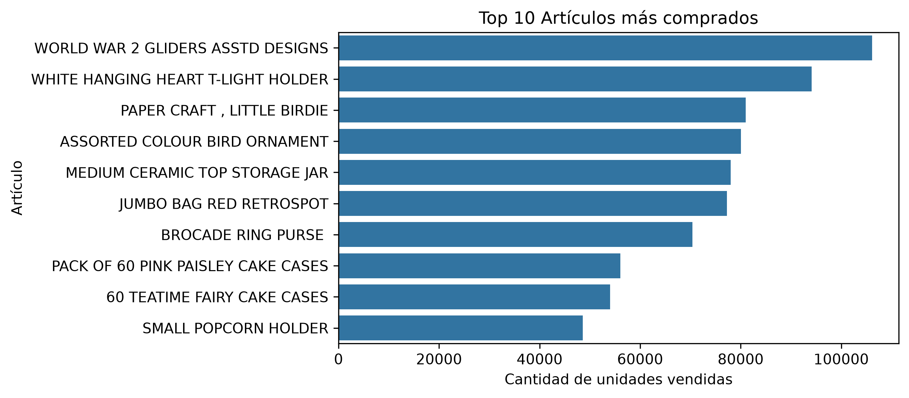
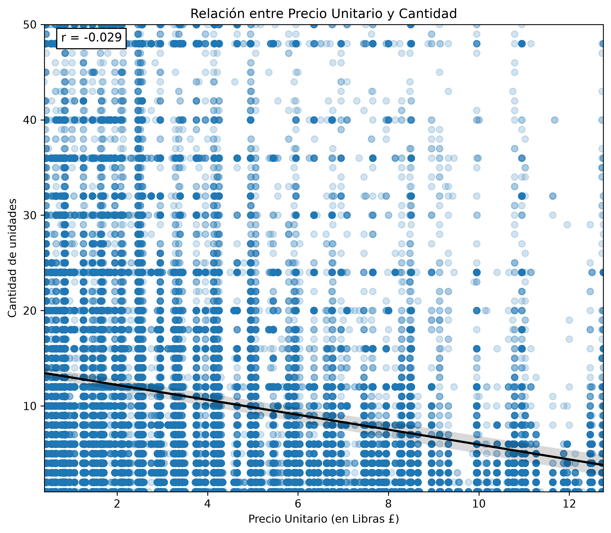
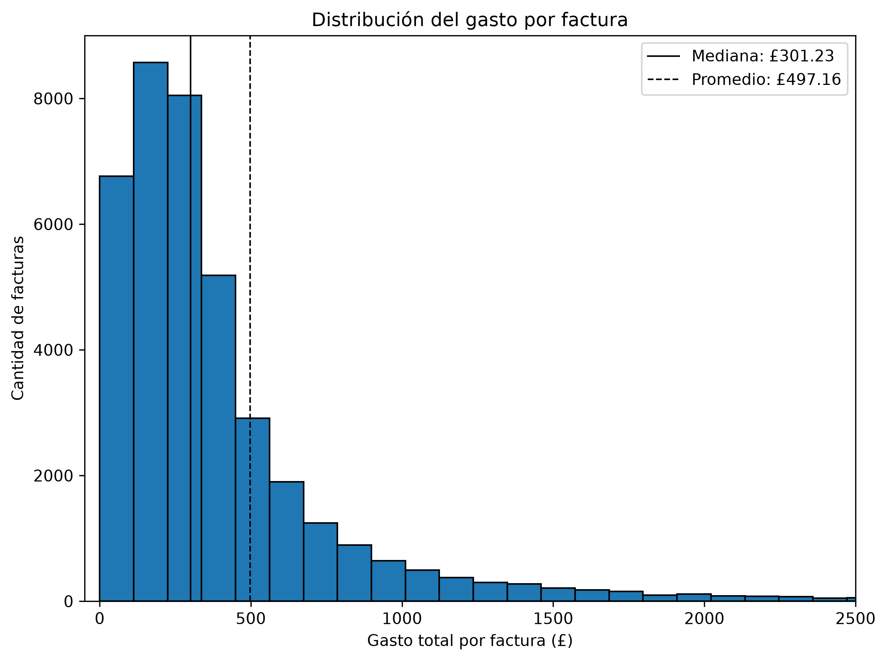
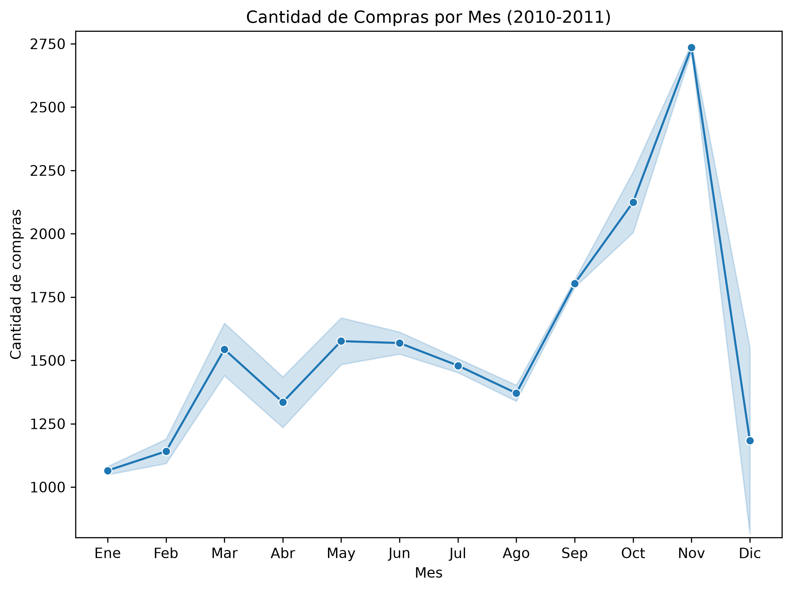
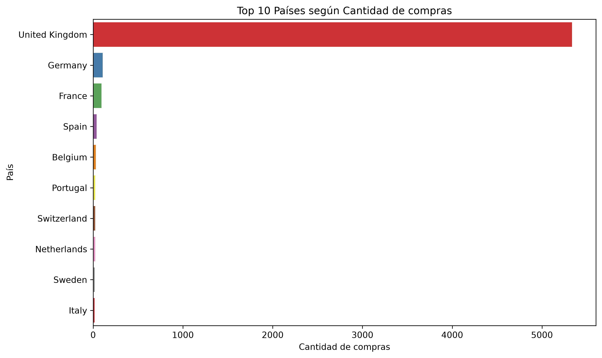
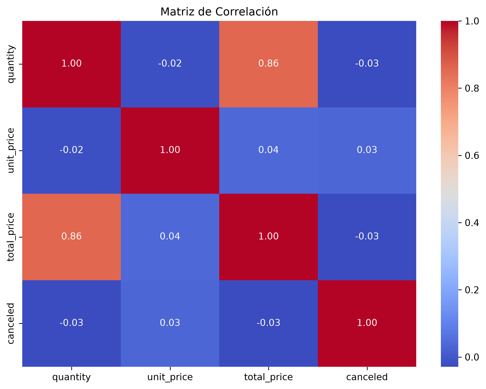

# Online Retail Analysis


## Descripción del Proyecto

Este proyecto es el trabajo final del curso "Data Scientist: Analytics" de Codecademy. Consiste en un Análisis Exploratorio de Datos (EDA) completo sobre el dataset **Online Retail II**, que contiene todas las transacciones realizadas entre el 1 de diciembre de 2009 y el 9 de diciembre de 2011 por una empresa de venta minorista en línea, con base en el Reino Unido y sin establecimiento físico, dedicada principalmente a la venta de artículos de regalo únicos para cualquier ocasión. Una gran parte de sus clientes son mayoristas.

Se eligió este dataset por su volumen (más de un millón de filas) y por contener datos faltantes, duplicados, registros administrativos y valores inconsistentes, lo que permitió aplicar un proceso realista de limpieza y curado antes del análisis.

El proyecto recorre el proceso completo de análisis de datos: carga del dataset, exploración inicial, limpieza y formateo, EDA guiado por preguntas de negocio, hallazgos claves y conclusiones.

Link Notebook: [nbviewer](https://nbviewer.org/github/AgusPluda/online-retail-analysis/blob/main/online_retail_analysis.ipynb)

---

## Objetivos

* Explorar la estructura y calidad del dataset.
* Limpiar y formatear los datos, documentando y justificando cada decisión tomada.
* Responder preguntas de negocio sobre artículos, facturas, clientes, fechas/horas y países a través de visualizaciones.
* Contrastar una hipótesis de negocio mediante una prueba estadística formal.
* Comunicar hallazgos claros y accionables a partir del análisis.

---

## Dataset

El dataset original (`online_retail_II.csv`) contiene las transacciones registradas por la empresa, con la siguiente estructura:

| Variable      | Descripción                                                          |
| ------------- | --------------------------------------------------------------------- |
| `Invoice`     | Número de factura (los que comienzan con "C" corresponden a cancelaciones) |
| `StockCode`   | Código de producto                                                    |
| `Description` | Descripción del producto                                              |
| `Quantity`    | Cantidad de unidades por línea de transacción                         |
| `InvoiceDate` | Fecha y hora en la que se generó la transacción                       |
| `Price`       | Precio unitario del producto (en libras esterlinas, £)                |
| `Customer ID` | Identificador único del cliente                                       |
| `Country`     | País del cliente                                                      |

Durante la limpieza se renombraron las columnas a snake_case y se agregaron variables derivadas (`invoice_date`, `invoice_time`, `canceled`, `total_price`), además de generarse tres subconjuntos: el dataset limpio completo, uno filtrado a productos comerciales y otro filtrado a ventas efectivas. Por el límite de tamaño de archivo de GitHub, estos CSV curados se alojan externamente ([enlace en el notebook](https://drive.google.com/drive/folders/1EDneaog4fd4tv6MaOQ1AsZ5pwIqul1bW?usp=sharing)) en lugar de subirse al repositorio.

Fuente: [Online Retail II — Kaggle](https://www.kaggle.com/datasets/mashlyn/online-retail-ii-uci)

---

## Tecnologías Utilizadas

* Python
* Pandas
* NumPy
* Matplotlib
* Seaborn
* SciPy (prueba de Mann–Whitney U)
* Jupyter Notebook

---

## Curado de Datos

Antes del EDA se realizó un proceso de limpieza y formateo justificado paso a paso:

* **Datos nulos:** de 247.389 celdas vacías, se eliminaron las filas sin descripción de producto (4.382); los IDs de cliente faltantes (243.007) se conservaron ya que el análisis no se centra en clientes individuales.
* **Duplicados:** se eliminaron 34.335 filas duplicadas.
* **Registros no comerciales:** mediante una expresión regular sobre `StockCode`, se identificaron y separaron los códigos administrativos (ajustes, cargos bancarios, gastos de envío, registros de prueba, etc.) en un DataFrame `df_products`, distinto del análisis de artículos.
* **Cantidades y precios inconsistentes:** se analizaron los valores de `Quantity` y `Price` menores o iguales a cero (cancelaciones, devoluciones y ajustes de inventario) y se generó `df_sales`, un DataFrame con únicamente transacciones de venta efectiva (cantidad y precio positivos).
* **Formateo:** columnas renombradas a snake_case, `customer_id` convertido a string, `invoice_datetime` convertido a datetime, y creación de las columnas derivadas `invoice_date`, `invoice_time`, `canceled` y `total_price`.

---

## Análisis Exploratorio de Datos (EDA)

El análisis se organizó en preguntas de negocio agrupadas por tema:

**Artículos**
* ¿Cuáles son los 10 artículos más comprados?
* ¿Cuáles son los 10 artículos más caros por unidad?
* ¿Cuáles son los 10 artículos más baratos por unidad?
* ¿Es más probable comprar más cantidad cuando el producto es más barato?

**Facturas y Clientes**
* ¿Cuánto gasta el cliente en promedio por factura?
* ¿Cuáles son las facturas más caras?
* ¿Qué clientes gastaron más?

**Fechas y Horas**
* ¿Existe un aumento en la cantidad de compras entre 2010 y 2011?
* ¿En qué meses del año se compra más?
* ¿A qué hora del día se dan más compras?

**Países**
* ¿De dónde provienen los clientes?
* ¿Qué porcentaje de clientes son extranjeros?

**Extras**
* Matriz de correlación entre cantidad, precio unitario, precio total y estado de cancelación.
* Hipótesis: ¿las facturas de mayor valor tienen mayor probabilidad de ser canceladas? Contrastada con boxplots, barplots con intervalo de confianza/bootstrap y una prueba de Mann–Whitney U.

---

## Hallazgos Claves

1. **Los regalos económicos para niños dominan las ventas.** Los 3 artículos más vendidos (aviones de cartón de la Segunda Guerra Mundial, porta velas colgantes con forma de corazón y un pack de manualidades de papel) son productos baratos, lo que confirma el perfil de "regalería" del negocio.
2. **El artículo más caro comprado fue una bandera de coche de Inglaterra**, vendida por casi £1.200; el resto del top 10 se compone principalmente de muebles.
3. **La relación entre precio unitario y cantidad comprada es prácticamente nula** (r = -0.029). El precio por sí solo no explica el volumen de compra.
4. **El gasto promedio por factura es de £497,16, pero la mediana es de solo £301,23**, lo que confirma la presencia de clientes mayoristas que elevan fuertemente el promedio.
5. **Existe una factura extrema que distorsiona varios análisis:** la N° 581.483, por más de £160.000, correspondiente a casi 81.000 unidades de un solo artículo, lo que explica por qué ese producto aparece en el top 3 de más vendidos.
6. **El cliente con la factura más cara también es uno de los que más gastó en total** (top 8 del ranking de clientes), indicando un comprador mayorista recurrente.
7. **La cantidad de compras cayó un 7,15% de 2010 a 2011**, contradiciendo la expectativa de crecimiento del comercio online en ese período.
8. **Noviembre es, por lejos, el mes con más compras**, previo a Navidad y Año Nuevo; marzo aparece como un segundo pico asociado a la Pascua de esos años.
9. **Las facturas se concentran entre las 6 y las 20 horas, con pico al mediodía**, reflejo de que eran cargadas manualmente por empleados durante su horario laboral.
10. **El negocio depende fuertemente del Reino Unido**: los clientes extranjeros (todos europeos) representan apenas un 9% de las ventas totales.
11. **Existe una diferencia estadísticamente significativa** (prueba de Mann–Whitney U, p < 0.05) entre el valor absoluto de las facturas canceladas y no canceladas.

---

## Visualizaciones de Muestra

### Top 10 Artículos más comprados

<p align="center">
  
</p>

---

### Relación entre Precio Unitario y Cantidad

<p align="center">
  
</p>

---

### Distribución del gasto por factura

<p align="center">
  
</p>

---

### Cantidad de Compras por Mes (2010-2011)

<p align="center">
  
</p>

---

### Top 10 Países según Cantidad de compras

<p align="center">
  
</p>

---

### Matriz de Correlación

<p align="center">
  
</p>

---

## Conclusiones

Este proyecto permitió recorrer el proceso completo de un análisis de datos real, desde la carga de un dataset con más de un millón de filas hasta la comunicación de hallazgos concretos. Trabajar con datos faltantes, duplicados, códigos no comerciales y valores inconsistentes en cantidad y precio implicó tomar decisiones de limpieza justificadas en cada paso, en lugar de aplicar reglas automáticas, resultando en un análisis que refleja la realidad de una tienda de regalería online con una fuerte componente mayorista.

El dataset también presenta limitaciones: no indica el motivo de cancelaciones o devoluciones, no incluye datos demográficos ni de segmentación de clientes más allá del país, abarca poco más de dos años (insuficiente para tendencias de largo plazo o estacionalidad robusta) y no contiene información de costos, por lo que no es posible calcular margen o rentabilidad, solo facturación.

Como próximos pasos, se plantea profundizar el análisis de clientes mediante una segmentación RFM (recencia, frecuencia, monto), explorar un análisis de canasta de mercado (market basket analysis), construir un modelo simple de series de tiempo para proyectar la demanda mensual, e incorporar herramientas de visualización interactiva (Power BI o Tableau) para navegar el análisis dinámicamente.

---

## Estructura del Proyecto

```text
online-retail-analysis/
│
├── data/
│   └── online_retail_II.csv
│
├── images/
│   ├── barhplot_top_10_articulos_comprados.png
│   ├── barhplot_top_10_articulos_caros.png
│   ├── barhplot_top_10_articulos_baratos.png
│   ├── scatter_precio_cantidad.png
│   ├── histplot_gasto_promedio_factura.png
│   ├── boxplot_gasto_promedio_factura.png
│   ├── barhplot_top_10_facturas_caras.png
│   ├── barhplot_top_10_clientes.png
│   ├── multiplot_cantidad_compras_por_año.png
│   ├── lineplot_cantidad_compras_mes.png
│   ├── histplot_compras_por_hora.png
│   ├── barhplot_top_10_paises.png
│   ├── pieplot_clientes_extranjeros.png
│   ├── correlation_heatmap.png
│   ├── boxplot_distribucion_factura_por_estado.png
│   ├── barplot_error_gasto_promedio_factura.png
│   └── barplot_gasto_factura_bootstrap.png
│
├── online_retail_analysis.ipynb
├── README.md
├── requirements.txt
└── .gitignore
```

---

## Autor

**Agustín Pluda**

Este proyecto fue desarrollado como parte de mi portafolio de Data Science, como trabajo final del curso Data Scientist: Analytics de Codecademy.
